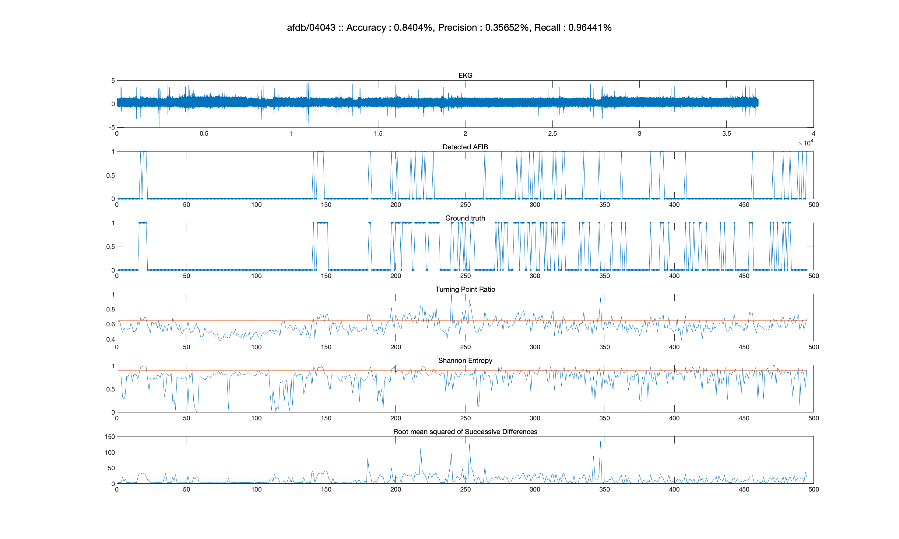

# Atrial-Fibrillation-Detection-from-BIH-MIT-Database
Takes data from the atrial fibrillation database from Physionet, and attempts to detect that atrial fibrillation using a number of statistical methods. Matlab code

The data sets used this code can be found at: http://www.physionet.org/physiobank/database/afdb/

* The original code was written so long ago that it did not run on Matlab 2018
  Here is the solution for Matlab 2018.
  Tested on Matlab 2018 of MacOS Mojave and Windows 10. 
  Please tell me if you have run successfully in other operating system.

## How to run
1. Clone or download this repository
2. Install the WFDB Application Toolbox
	1. Go to <i>mcode</i> directory on MATLAB
	2. Type <i>addpath(pwd); savepath;</i>
		- You can see this instruction from README.txt in <i>mcode</i> directory too
3. Run loadData.m
	- This may take a while as it downloads the dataset from physionet.
4. Run dataTest.m
	- Change the treshold values to see if anything good happens!
	- List of the threshold in the code.
		- THR\_TPR
		- THR\_SE
		- THR\_RMSSD
	- The screenshot of the prediction result is saved in the <i>screenshot</i> directory automatically. So feel free to check!

- testAll.m tests AF detection while changing the threshold values. This may take a long time.
